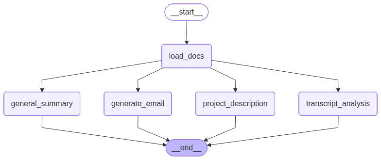

# Meeting Transcript Analyzer

A small LangGraph/LangChain project that reads a **meeting transcript PDF** and produces four artifacts:
1) a participants & specialization analysis,
2) a per‑participant general summary (with ideas/support/opposition/neutrality),
3) a project description,
4) a follow‑up email draft.

The entry point loads your PDF (default: `project_meetings.pdf`) and executes a parallel graph of nodes that each call the same LLM chain with a different prompt. Results are printed to the console and a Mermaid diagram of the graph is generated as `graph.png`:


---

## Features

- **PDF ingestion** via `PyPDFLoader`.  
- **Composable LLM chain** built from a shared prompt template → `ChatOpenAI` → `StrOutputParser`.  
- **LangGraph state machine** with nodes:
  - `load_docs` → loads the transcript
  - `transcript_analysis` → extracts roles/specializations + agenda
  - `general_summary` → rolls up ideas/support/opposition/neutrality
  - `project_description` → “what the project is about / tech / problems / near‑term plans”
  - `generate_email` → polite recap + next steps + next meeting date = 10 days from today  
  All four analytical nodes run after `load_docs` and then terminate.
- **Mermaid graph image** is saved as `graph.png` when the graph is compiled.

---

## Project Structure

```
.
├─ main.py                 # CLI entry point that invokes the graph and prints all sections
├─ pyproject.toml          # Project metadata and dependencies (Python >= 3.13)
├─ graph/
│  ├─ chains.py            # LLM chain: prompt | ChatOpenAI(model="gpt-4o") | StrOutputParser
│  ├─ consts.py            # Node/section names & keys used across the app
│  ├─ graph.py             # LangGraph definition, edges, compile, and mermaid export
│  ├─ nodes.py             # Node functions: load_docs, transcript_analysis, general_summary, project_description, generate_email 
│  ├─ prompts.py           # Shared prompt template with current date + docs + user question 
│  └─ state.py             # Typed state + reducers for concurrent updates (keep_last/merge_dicts)
└─ project_meetings.pdf    # Your input PDF (you provide this file)
```

> **Note:** The code imports from the `graph` package (e.g., `from graph.nodes import ...`), so ensure these files live under a `graph/` directory (with an `__init__.py`) in your repo.

---

## Prerequisites

- **Python**: 3.13+ (as declared in `pyproject.toml`).
- **Generative engine API key and base URL** (for `langchain-openai`). Create a `.env` in the project root:
```env
- `GEP_API_KEY`: API key for accessing the LLMs on the Generative engine platform
- `GEP_API_URL`: Base URL for the Generative Engine API endpoint
```
  The app loads environment variables on startup.

---

## Setup (with `uv`)

This project is configured to use [`uv`](https://github.com/astral-sh/uv) for environment management and dependency resolution.

### One‑liner (recommended)
```bash
# Creates a .venv and installs dependencies from pyproject.toml
uv sync
```

### Manual steps
```bash
# 1) Create and activate a virtual environment
uv venv           # creates .venv
# Windows PowerShell:
.venv\Scripts\Activate.ps1
# macOS/Linux:
source .venv/bin/activate

# 2) Install dependencies declared in pyproject.toml
uv sync
```

### Keep dependencies in sync
- Add a new dependency:
  ```bash
  uv add package-name
  ```
- Remove a dependency:
  ```bash
  uv remove package-name
  ```
- Update pins:
  ```bash
  uv lock --upgrade
  uv sync
  ```

`pyproject.toml` includes: `langchain`, `langchain-community`, `langchain-openai`, `langgraph`, `pypdf`, and `python-dotenv`.

---

## Running

1. Put your transcript PDF at the project root (default name: `project_meetings.pdf`).
2. Run the app:
   ```bash
   uv run python main.py
   ```
   This will:
   - load your PDF, run all graph nodes, and print four sections to stdout,
   - generate a Mermaid diagram of the graph as `graph.png`. 

> To target a different file, edit `file_path` in `main.py` or adjust how you invoke the graph. 

---

## How It Works (quick tour)

- **State & reducers:** `State` tracks `file_path`, `docs`, and `generation`. Concurrent writes to `generation` are merged; `file_path`/`docs` are last‑write wins. 
- **Prompting:** A single `ChatPromptTemplate` (parameterized with current date, docs, and a task‑specific question) feeds the LLM. 
- **Chain:** `prompt | ChatOpenAI(model="gpt-4o") | StrOutputParser` is reused by all analytical nodes. 
- **Graph:** `load_docs` → runs first; four analysis nodes run next; the flow ends. The graph is compiled and rendered as an image. 
- **Nodes:** Each node asks the same chain a different question—analysis, summary, project description, and an email with a next‑meeting date set to “today + 10 days.” 

---

## Troubleshooting

- **No results / empty output** → ensure `project_meetings.pdf` exists and is a readable PDF.
- **OpenAI auth errors** → verify `OPENAI_API_KEY` is set in `.env`. The app calls `load_dotenv()` at startup. 

---

## Scripts & Useful Commands

```bash
# Install & sync (fresh machine)
uv sync

# Run the app
uv run python main.py

# Regenerate graph diagram (happens on compile/import)
uv run python -c "from graph.graph import app; print('graph compiled')"  # creates/updates graph.png 
```

---

## Prompts and outputs

### 1. Transcript analysis
```
Conduct the transcript analysis. It is necessary to determine specialization of each meeting participants
Create a list of meeting participants, indicate the name and potential specialization for each.   
Expected output format:
Meeting (meeting date):
Participants:
1. Sarah Connor: scrum master
2. Kent Smith: software engineer
...
Agenda: (what was the meeting about, what was decided as the result of the meeting, top 3 challenges, top 3 insights)
```

**Result:** (truncated)
```
**Meeting (12 August 2023):**

**Participants:**
1. Sarah: Project Manager
2. Bob: Product Manager
3. Emily: Frontend Developer
4. Liam: Software Engineer
5. Raj: Backend Developer
6. Mia: Database Specialist
7. Chloe: UI/UX Designer
8. David: QA Specialist

**Agenda:**
- **Meeting Focus:** Clarifying requirements for a web-based to-do app.
- **Decisions Made:** 
  - Core features identified: task creation, categorization, due dates, and notifications.
  - Use React for frontend and Node.js with Express for backend.
  - MongoDB chosen for database management.
  - MVP timeline set for two months.
- **Top 3 Challenges:**
  1. Ensuring scalability and real-time updates.
  2. Designing a clean and responsive UI for both desktop and mobile.
  3. Defining clear acceptance criteria for QA.
- **Top 3 Insights:**
  1. Importance of modularity for future feature expansion.
  2. Need for a flexible database to handle different data structures.
  3. Establishing a timeline and working in sprints for effective project management.

...

```

### 2. General summary
```
Create a general summary of all meetings for each participant: 
name of the participant;
summary what he was saying. 

In addition, it is necessary to find out who generated ideas,
who criticized it, who supported it, who was neutral. 

Expected response structure should be as follow:

Participant: Sarah Connor
Summary: (Summary)
Ideas: 
  1. (Sarah's idea 1)
     Supporters: John Doe, Mike Smith
     Opposition: -
     Neutrals: Kate Jones
  2. (Sarah's idea 2)
     Supporters: Kate Jones
     Opposition: John Doe
     Neutrals: -
```

**Result:** (truncated)
```
Participant: Sarah
Summary: Sarah led the meetings, focusing on clarifying project requirements, establishing timelines, and addressing customer feedback. She proposed the initial MVP timeline and managed discussions on feature prioritization and performance issues.
Ideas:
  1. Establishing a timeline for the MVP with core features like task creation, categorization, and notifications.
     Supporters: Bob, Emily
     Opposition: -
     Neutrals: -
  2. Postponing the task assignment feature to a post-MVP release.
     Supporters: Bob, Liam
     Opposition: -
     Neutrals: -
  3. Addressing performance issues with a solution within a month.
     Supporters: -
     Opposition: -
     Neutrals: Bob
...
```

## 3. Project description
```
Create a description of the project
Include:
- What the project is about?
- What technologies are used in the project for the frontend, backend, data storage, etc.?
- What problems does the project has, what is planned to be implemented in the near future?
```

**Result:** (truncated)
```
The project is focused on developing a web-based to-do application designed to be straightforward and efficient for task management. The core functionality includes task creation, categorization, due dates, and notifications, with an emphasis on user-friendliness and a clean, responsive design suitable for both desktop and mobile access.

**Technologies Used:**
- **Frontend:** The project utilizes React for its frontend development to maintain modularity and ensure a clean, responsive design.
- **Backend:** Node.js with Express is used for the backend to ensure scalability and handle real-time updates, particularly for notifications.
- **Data Storage:** MongoDB is chosen for its flexibility in handling different data structures, which is essential for managing task data efficiently.

**Current Problems and Future Plans:**
- **Performance Issues:** The application struggles with maintaining speed when there are many concurrent users. This is primarily due to the way data fetches and task updates are currently handled, leading to slow response times.
...
```

## 4. Generate email
```
Based on the results of the last three meetings, write the text of the letter for all participants. 
Ensure optimistic and businesslike tone. In the text of the letter, 
- summarize the meetings, 
- include the next steps to be taken. 
Don't forget to thank each participant. Also indicate the date of the next meeting as 10 days after today's date. 
```

**Result:** (full)
```
Subject: Project Update and Next Steps

Dear Team,

I hope this message finds you well. I wanted to take a moment to express my gratitude for your continued dedication and valuable contributions to our project. Over the last few meetings, we've made significant progress, and I am excited to share a summary of our discussions and outline the next steps.

**Meeting Summaries:**

1. **August 12, 2023:** We focused on clarifying the core functionality of our web-based to-do app. Key features such as task creation, categorization, due dates, and notifications were prioritized. We agreed on using React for the frontend and Node.js with Express for the backend, with MongoDB as our database. Our goal is to deliver an MVP within two months, focusing on these core features.

2. **December 18, 2023:** We discussed the potential addition of a task assignment feature based on customer feedback. While this feature is valuable, we decided to prioritize it for a post-MVP release to maintain our current timeline. We will document the requirements and revisit this feature after the MVP launch.

3. **February 5, 2024:** Our focus was on improving app performance, particularly under high user loads. We explored solutions such as caching and using Redis for frequently accessed data. Raj and Mia will prototype the Redis approach, and we aim to have a working solution within a month.

**Next Steps:**

- **MVP Development:** Continue working in sprints to develop and test core features, ensuring a smooth integration and user experience.
- **Redis Prototype:** Raj and Mia will assess the feasibility of integrating Redis to enhance performance. We will review progress in two weeks.
- **Documentation:** Document the requirements for the task assignment feature for future implementation.

I am confident that with our collective efforts, we will achieve our project goals. Thank you, Bob, Emily, Liam, Raj, Mia, Chloe, and David, for your hard work and insightful input.

Our next meeting is scheduled for October 17, 2025. I look forward to our continued collaboration and success.

Best regards,

Sarah
```